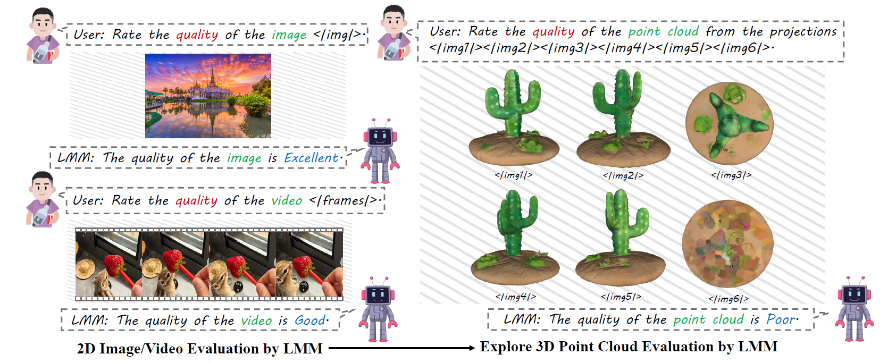
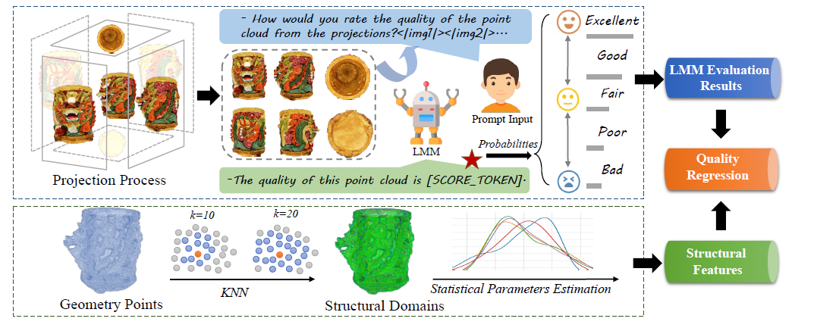

<div align="center">
    
    
 <div>

<a href="https://github.com/zzc-1998/"></a>
    <a href="https://github.com/zzc-1998/LMM-PCQA"></a>
    <a href="https://arxiv.org/abs/2404.18203"></a>
    <a href="https://huggingface.co/datasets/zhangzicheng/pcqa_dataset_projections"></a>
   </div>


  
  <h1>LMM-PCQA: Assisting Point Cloud Quality Assessment with LMM</h1>
  
_ACM MM2024 Oral_

  <div>
      <a href="https://zzc-1998.github.io/" target="_blank">Zicheng Zhang</a><sup>1</sup>,
      <a href="https://teowu.github.io/" target="_blank">Haoning Wu</a><sup>2</sup>,
      <a href="https://scholar.google.com/citations?hl=zh-CN&user=85yWgIcAAAAJ" target="_blank">Yingjie Zhou</a><sup>1</sup>,
      <a href="https://github.com/lcysyzxdxc" target="_blank">Chunyi Li</a><sup>1</sup><sup>*</sup>,
      <a href="https://scholar.google.com/citations?hl=zh-CN&user=nDlEBJ8AAAAJ" target="_blank">Wei Sun</a><sup>1</sup>,
  </div>

<div>
      <a href="https://chaofengc.github.io" target="_blank">Chaofeng Chen</a><sup>2</sup>,
      <a href="https://minxiongkuo.github.io/" target="_blank">Xiongkuo Min</a><sup>1</sup><sup>#</sup>,
      <a href="https://scholar.google.ca/citations?user=Tq2hoMQAAAAJ&hl=en" target="_blank">Xiaohong Liu</a><sup>1</sup>,
      <a href="https://personal.ntu.edu.sg/wslin/Home.html" target="_blank">Weisi Lin</a><sup>2</sup>,
      <a href="https://ee.sjtu.edu.cn/en/FacultyDetail.aspx?id=24&infoid=153&flag=153" target="_blank">Guangtao Zhai</a><sup>1</sup><sup>#</sup>
      
  </div>
  <div>
  <sup>1</sup>Shanghai Jiaotong University,  <sup>2</sup>Nanyang Technological University
       </div>   
<div>
<sup>#</sup>Corresponding authors. 
   </div>
  <a href="https://arxiv.org/abs/2404.18203"><strong>Paper</strong></a> |
<a href="https://github.com/zzc-1998/LMM-PCQA"><strong>Github</strong></a> |
 <a href="https://huggingface.co/datasets/zhangzicheng/pcqa_dataset_projections"><strong>Data</strong></a> 
   <div style="width: 100%; text-align: center; margin:auto;">
      
  </div>
  <div style="width: 100%; text-align: center; margin:auto;">
      
  </div>
  
<div align="left">
    

## How to infer PCQA with LMM

This part only introduces the usage of the **projection branch with LMM**.

1) Prepare the environment of [Q-Align](https://github.com/Q-Future/Q-Align).

2) Get the LMM weights: [SJTU](https://huggingface.co/q-future/q-align-pcqa-sjtu) [WPC](https://huggingface.co/q-future/q-align-pcqa-wpc) [WPC2.0](https://huggingface.co/q-future/q-align-pcqa-wpc2)

3) Download the projections and meta information from [Huggingface](https://huggingface.co/datasets/zhangzicheng/pcqa_dataset_projections).

4) Modify the necessary input args of the [`pcqa_eval.py'](https://github.com/zzc-1998/LMM-PCQA/blob/main/pcqa_eval.py) file in this repo and begin the inference with Q-Align.
  


## Contact

Please contact any of the first authors of this paper for queries.

- Zicheng Zhang, `zzc1998@sjtu.edu.cn`, @zzc-1998

## Citation

If you find our work interesting, please feel free to cite our paper:

```bibtex
@article{zhang2024lmm,
  title={LMM-PCQA: Assisting Point Cloud Quality Assessment with LMM},
  author={Zhang, Zicheng and Wu, Haoning and Zhou, Yingjie and Li, Chunyi and Sun, Wei and Chen, Chaofeng and Min, Xiongkuo and Liu, Xiaohong and Lin, Weisi and Zhai, Guangtao},
  journal={ACM MM},
  year={2024}
}
```
